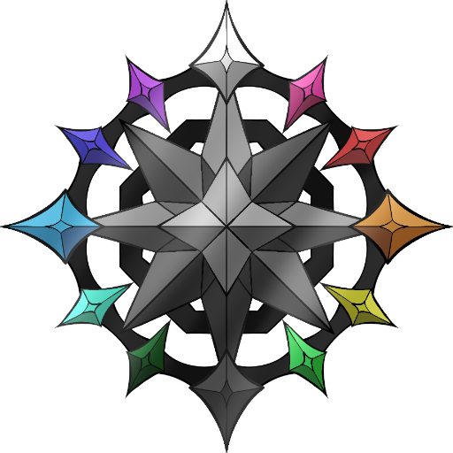

<p align="center">
  
</p>

<h1 align="center">Web-DraconDex</h1>

<p align="center">
  The website for <a href="https://github.com/LDKTC/App-DraconDex">DraconDex</a>,
  deployed to GitHub Pages.
</p>

<p align="center">
  <strong><a href="https://ldktc.github.io/Web-DraconDex/">ldktc.github.io/Web-DraconDex</a></strong>
</p>

---

## What's here

Three static pages, no build step, no dependencies:

| Page | Covers |
|---|---|
| `index.html` | What DraconDex is, its features, the v3 module tree, a plugin teaser, and links to the docs |
| `download.html` | The latest release's assets, which build to pick, checksum verification, the Android APK route, and the npm package |
| `plugins.html` | Every official plugin, how installing from a link works, what the sandbox does and doesn't allow, and how to write your own |

Supporting files:

```
assets/css/site.css     one stylesheet; colors and fonts mirror the app's design tokens
assets/js/icons.js      shared inline-SVG icon set (Lucide paths), used in place of emoji
assets/js/theme.js      midnight/daylight/moonlight theme switch, persisted to localStorage
assets/js/lang.js       English/Thai language switch, persisted to localStorage
assets/js/strings.th.js the Thai dictionary that assets/js/lang.js swaps in
assets/js/releases.js   reads the GitHub Releases API for the download pages
assets/js/plugins.js    the plugin catalogue, refreshed from live manifests
assets/brand/           logo and icon, downscaled from the app repository
assets/fonts/           self-hosted Kanit + IBM Plex Sans Thai, Latin+Thai subsets only
assets/screenshots/     app screenshots for the module-tree and theme-mockup sections on index.html
.nojekyll               serve the files as-is, no Jekyll processing
```

## Theme switch and language switch

The topbar has two buttons next to each other: a language toggle (`TH`/`EN`)
and a theme toggle. Both mirror the same pattern — a small script loaded
synchronously in `<head>` so the stored choice (`localStorage`) applies before
first paint, avoiding a flash of the wrong theme or language.

- **Theme** cycles through the app's three built-in themes — midnight
  (default, dark), daylight (light) and moonlight (dark blue) — matching
  `src/design/tokens/tokens.json` in the app repository. With nothing stored,
  it follows the OS light/dark preference (between midnight and daylight
  only; moonlight is always an explicit pick).
- **Language** swaps every element tagged `data-i18n="key"` (and
  `data-i18n-attr="attr:key"` for attributes like `aria-label` or `alt`)
  against the Thai dictionary in `assets/js/strings.th.js`. English lives
  directly in the HTML — nothing needs to be listed there for the English
  side. Content injected at runtime by `releases.js`/`plugins.js` (release
  labels, plugin cards) is sourced live from GitHub and is not translated.

The index page also has a "Theme mockups" section using the same coverflow
carousel as the module-tree screenshots (`assets/js/mod-slider.js` already
initializes every `[data-mod-slider]` element on the page, so a second
carousel instance needs no extra JS) to show off daylight, moonlight and a
few of the example palettes from the app's in-app Custom Theme editor.

## Why the data is fetched in the browser

Release versions, asset sizes and plugin manifests all change in *other*
repositories. Rather than rebuilding this site whenever one of them does, each
page reads them at load time:

- **Releases** come from `api.github.com/repos/LDKTC/App-DraconDex/releases`.
  Anonymous API requests are capped at 60/hour per IP, so every entry point
  falls back to a plain link to the Releases page when that runs out, and
  responses are cached in `sessionStorage` for ten minutes.
- **Plugin manifests** come from `raw.githubusercontent.com`, which is
  CORS-open and outside the API rate limit. Each card ships with the manifest
  values baked in, so a failed fetch is a no-op rather than an empty page.

## Local preview

Any static file server works — the pages use relative links only:

```bash
python3 -m http.server 8000
# then open http://localhost:8000
```

## Deployment

`.github/workflows/deploy-pages.yml` publishes the repository root to GitHub
Pages on every push to `main`, and can also be run manually from the Actions
tab. It needs **Settings → Pages → Source** set to **GitHub Actions** once.

## Keeping it in sync with the app

A few things here are copies of facts that live in
[`LDKTC/App-DraconDex`](https://github.com/LDKTC/App-DraconDex) and need
updating when that repository changes:

- The color tokens at the top of `assets/css/site.css` (and the theme cycle
  in `assets/js/theme.js`) mirror `src/design/tokens/tokens.json` — currently
  three themes: midnight, daylight, moonlight.
- The `theme-*.png` files in `assets/screenshots/` (see the README there) are
  exported from the same `docs/mockups/` as the module-tree screenshots.
- The release asset names matched in `assets/js/releases.js` come from
  `.github/workflows/build-electron.yml`.
- The manifest limits listed on `plugins.html` come from `docs/PLUGINS.md`.
- The logo files in `assets/brand/` come from `src/assets/brand/`. The master
  `DraconDex_Color.png` is 1839px and ~550 KB, so the site ships 512px and
  64px copies of it instead — regenerate both if the mark ever changes.

To add a plugin to the catalogue, append an entry to the `PLUGINS` array in
`assets/js/plugins.js` — both the home page teaser and the plugins page read
from it.

## License

MIT — see [LICENSE](LICENSE).
